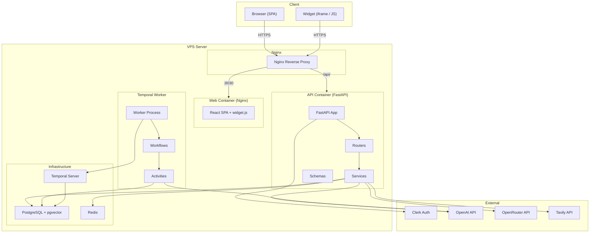

# AEOGEO — Полная документация проекта

---

## 1. Обзор проекта

### Назначение

**AEOGEO** (Answer Engine Optimization / Generative Engine Optimization) — B2B SaaS-платформа для управления AI-видимостью брендов. Платформа помогает клиентам отслеживать, как их бренд упоминается, цитируется и рекомендуется AI-движками ответов (ChatGPT, Gemini, Perplexity, Claude и др.).

**Слоган:** "Get Advertised by AI"

**Основной цикл:** измерение AI-видимости → генерация/публикация AI-читаемого контента → модерация → повторное измерение и оптимизация.

### Целевая аудитория

Маркетологи и владельцы бизнеса, которым важно присутствие в ответах AI-систем.

### Текущий статус

Проект находится на стадии **активной разработки (MVP+)**. Реализованы:

- ✅ Аутентификация через Clerk (JWT)
- ✅ Multi-tenant архитектура (Tenant → User → Project)
- ✅ RBAC (3 роли, 14 разрешений)
- ✅ Онбординг проекта (бренд, продукты, конкуренты, краулинг сайта)
- ✅ Pipeline visibility-анализа: Temporal workflows для запуска AI-движков, парсинга ответов, скоринга
- ✅ Knowledge base с embeddings (pgvector + OpenAI text-embedding-3-large)
- ✅ Генерация контента по шаблонам (FAQ, Blog, Comparison и др.)
- ✅ Виджеты (FAQ accordion, Blog feed) с Shadow DOM изоляцией
- ✅ Dashboard с обзором метрик, visibility analytics
- ✅ Система отчётов
- ✅ i18n (English + Russian)
- ✅ Widget embed (JS bundle + iframe)
- ✅ Smoke-тесты (web + API)
- ✅ CI через GitHub Actions

**Не реализовано:**
- ❌ `VisibilityService` — все методы возвращают hardcoded данные (stub)
- ❌ `crawl_engine_activity` и `ingest_document_activity` — бросают `NotImplementedError`
- ❌ Self-serve регистрация и онбординг (only invite-based)
- ❌ Биллинг
- ❌ Content audit loop (автоматические повторные запуски через 48ч после публикации контента)
- ❌ Before/after attribution (маппинг контент-пушей на изменения скоров)
- ❌ Дополнительные AI-движки (Meta AI и др.)
- ❌ Реферальная программа (Tolt)

### Краткое резюме

Монорепозиторий с тремя пакетами: Python-бэкенд (FastAPI), React-фронтенд (Vite + TanStack), и standalone виджет (vanilla TS). Бэкенд оркестрирует длительные pipeline-задачи через Temporal. Данные хранятся в PostgreSQL с расширением pgvector. Аутентификация через Clerk. Деплой на VPS через Docker Compose + rsync.

---

## 2. Архитектура

### Тип архитектуры

**Модульный монолит** в формате монорепозитория (bun workspaces). Три пакета разделены логически, но деплоятся на один VPS.

### Архитектурная схема



### Request Flow

**Backend:** `Router` → `Service` → DB (async SQLAlchemy). Все роутеры монтируются под `/api/v1`. FastAPI DI предоставляет `get_db`, `get_current_user` (Clerk JWT → User), `get_system_admin`.

**Frontend:** `Route Component` → `TanStack Query hook (use-*.ts)` → `API Client (api-client.ts)` → `fetch()` с Bearer token. Токены Clerk кэшируются 50 секунд (`src/lib/auth.ts`).

**Auth:** Clerk → frontend получает session token → backend верифицирует через JWKS → резолвит локального `User`. Новые Clerk-пользователи без локальной записи редиректятся на `/complete-signup` → `POST /api/v1/auth/bootstrap`.

### Background Processing

Temporal оркестрирует pipeline. Task queue: `aeogeo-pipeline`. Ключевая цепочка:

```
FullPipelineWorkflow → RunEngineWorkflow → ParseAnswersWorkflow → ScoreRunWorkflow
```

Дополнительные workflows: `IngestionWorkflow`, `ScheduledRunWorkflow`, `ContentAuditWorkflow`.

### Паттерны проектирования

| Паттерн | Где используется |
|---------|-----------------|
| **Repository/Service** | `app/services/*` — бизнес-логика отделена от HTTP слоя |
| **Dependency Injection** | FastAPI `Depends()` — `get_db`, `get_current_user`, `get_settings` |
| **Pipeline/Chain** | Temporal workflows — последовательность шагов с retry |
| **Multi-tenant** | `Tenant` → `User` → `Project` — изоляция данных по tenant_id |
| **RBAC** | `Role` → `Permission` → `RolePermission` → `UserRole` |
| **Adapter** | `EngineConnector` — абстракция над разными AI-провайдерами |
| **Observer** | SSE streaming для прогресса pipeline и краулинга |

---

## 3. Стек технологий

### Backend

| Технология | Версия | Роль | Где используется |
|-----------|--------|------|-----------------|
| Python | 3.12+ | Язык бэкенда | `packages/api/` |
| FastAPI | latest | Web-фреймворк | `app/main.py`, `app/routers/` |
| SQLAlchemy | 2.0 async | ORM | `app/models/`, `app/services/` |
| asyncpg | latest | PostgreSQL async driver | `app/dependencies.py` |
| Pydantic | ≥2.0 | Валидация данных | `app/schemas/`, `app/config.py` |
| pydantic-settings | latest | Конфигурация из .env | `app/config.py` |
| Alembic | latest | Миграции БД | `packages/api/alembic/` |
| Temporal | latest | Оркестрация pipeline | `app/workflows/` |
| pgvector | latest | Векторный поиск | `app/utils/embeddings.py`, `app/models/knowledge.py` |
| Crawl4AI + Playwright | latest | Web-краулинг | `app/services/ingestion.py` |
| Redis | latest (hiredis) | Кэш, rate limiting | `app/services/rate_limiter.py`, `app/services/parse_runner.py` |
| httpx | latest | HTTP-клиент (OpenAI, Clerk) | `app/utils/embeddings.py`, `app/services/clerk.py` |
| cryptography (Fernet) | latest | Шифрование API-ключей | `app/utils/encryption.py`, `app/services/ai_key.py` |
| python-jose | latest | JWT-операции | `app/utils/jwt.py` |
| tiktoken | latest | Подсчёт токенов | AI-сервисы |
| PyMuPDF | latest | Парсинг PDF | `app/utils/document_parser.py` |
| python-docx | latest | Парсинг DOCX | `app/utils/document_parser.py` |
| uvicorn | latest | ASGI-сервер | Dockerfile, scripts |

### Frontend

| Технология | Версия | Роль | Где используется |
|-----------|--------|------|-----------------|
| React | ^18.3 | UI framework | `packages/web/src/` |
| TypeScript | ^5.7 | Типизация | Весь фронтенд |
| Vite | ^6.0 | Бандлер и dev-сервер | `vite.config.ts` |
| TanStack Router | ^1.90 | File-based routing | `src/routes/` |
| TanStack Query | ^5.60 | Data fetching + кэш | `src/hooks/use-*.ts` |
| Clerk React | ^6.1.3 | Аутентификация UI | `src/app.tsx`, `src/routes/_auth/` |
| shadcn/ui | latest | UI-компоненты | `src/components/ui/` (27 компонентов) |
| Radix UI | latest | Headless UI primitives | Dialog, Dropdown, Tabs, Switch и др. |
| Tailwind CSS | ^4.0 | Утилитарные стили | `src/globals.css` |
| Recharts | ^3.8 | Графики | Visibility, Dashboard |
| Lucide React | ^1.7 | Иконки | Везде в UI |
| i18next | ^25.10 | Интернационализация | `src/i18n/` (en + ru, 15 namespaces) |
| sonner | ^2.0 | Toast-уведомления | `src/components/ui/sonner.tsx` |
| next-themes | ^0.4.6 | Dark/Light theme | `src/lib/theme.ts` |

### Widget

| Технология | Версия | Роль |
|-----------|--------|------|
| TypeScript | ^5.7 | Язык |
| Vite | ^6.0 | Library mode build → `widget.js` |
| Shadow DOM | native | CSS-изоляция виджета |

### Database

| Технология | Версия | Роль |
|-----------|--------|------|
| PostgreSQL | 16 | Основная БД |
| pgvector | latest | Расширение для vector embeddings |
| Redis | 7-alpine | Кэш, rate limiting |

### DevOps / Инструменты

| Технология | Роль |
|-----------|------|
| Docker Compose | Оркестрация контейнеров (dev + prod) |
| Nginx | Reverse proxy (prod), SPA-сервер (web container) |
| Bun | Package manager + runtime (workspaces) |
| uv | Python package manager |
| rsync + SSH | Деплой на VPS |
| GitHub Actions | CI (lint, typecheck, test, build) |

### Тестирование

| Технология | Роль | Покрытие |
|-----------|------|----------|
| Vitest | Frontend-тесты | 4 test-файла в `src/lib/` |
| pytest | Backend-тесты | 5 test-файлов в `tests/` |
| Ruff | Python linter/formatter | `ruff check .`, `ruff format .` |
| ESLint | TS/JS linter | `eslint.config.js` (flat config) |
| mypy | Python type checking | strict mode |

---

## 4. Структура проекта

```
AEOGEO/
├── .env.example                 # Переменные окружения (верхнеуровневые)
├── .gitignore
├── .dockerignore
├── CLAUDE.md                    # Инструкции для AI-ассистента
├── DESIGN_BRIEF.md              # Дизайн-спецификация (725 строк)
├── README.md                    # Основная документация проекта
├── landing-page.md              # Спецификация лендинга
├── package.json                 # Root: bun workspaces, concurrently
├── bun.lock                     # Lock-файл bun
├── docker-compose.yml           # Dev: api, web, db, redis, temporal
├── docker-compose.prod.yml      # Prod: api, web, worker, db, redis, temporal
├── scripts/
│   └── deploy-web-prod.sh       # Скрипт деплоя web на VPS
│
├── packages/
│   ├── api/                     # ===== BACKEND =====
│   │   ├── .env.example         # Переменные окружения API
│   │   ├── .python-version      # Python 3.12
│   │   ├── Dockerfile           # Docker-образ API
│   │   ├── pyproject.toml       # Python-зависимости (uv/hatch)
│   │   ├── uv.lock              # Lock-файл uv
│   │   ├── package.json         # npm-скрипты для удобства
│   │   ├── alembic.ini          # Конфигурация Alembic
│   │   ├── alembic/
│   │   │   ├── env.py           # Alembic environment (async)
│   │   │   └── versions/        # 13 миграций
│   │   ├── tests/               # 5 тест-файлов
│   │   │   ├── test_feedback_service.py
│   │   │   ├── test_report_routes.py
│   │   │   ├── test_report_service.py
│   │   │   ├── test_widget_routes.py
│   │   │   └── test_widget_service.py
│   │   └── app/
│   │       ├── __init__.py
│   │       ├── main.py           # Точка входа FastAPI (монтирование роутеров)
│   │       ├── config.py         # Settings (pydantic-settings)
│   │       ├── dependencies.py   # DI: get_db, get_current_user, get_redis и др.
│   │       ├── seed.py           # Seed-скрипт (tenant, roles, engines, templates)
│   │       ├── export_openapi.py # Экспорт OpenAPI-спеки
│   │       ├── middleware/
│   │       │   └── cors.py       # CORS middleware
│   │       ├── models/           # 31 SQLAlchemy-модель
│   │       ├── schemas/          # 28 Pydantic-схем
│   │       ├── routers/          # 25 API-роутеров
│   │       ├── services/         # 36 сервисов (бизнес-логика)
│   │       ├── utils/            # Утилиты (embeddings, encryption, jwt, pagination, document_parser)
│   │       └── workflows/        # 10 файлов (Temporal workflows + activities)
│   │
│   ├── web/                     # ===== FRONTEND =====
│   │   ├── .env.example         # Переменные окружения web
│   │   ├── Dockerfile           # Dev-образ
│   │   ├── Dockerfile.prod      # Multi-stage build (bun → nginx)
│   │   ├── nginx.conf           # Nginx SPA config
│   │   ├── package.json         # Зависимости web
│   │   ├── tsconfig.json
│   │   ├── vite.config.ts       # Vite + React + Tailwind + TanStack Router + widget plugin
│   │   ├── eslint.config.js     # ESLint flat config
│   │   ├── components.json      # shadcn/ui config
│   │   ├── index.html           # HTML entrypoint
│   │   ├── scripts/
│   │   │   ├── generate-api-types.mjs  # Генерация TS-типов из OpenAPI
│   │   │   └── check-api-types.mjs     # Проверка типов
│   │   └── src/
│   │       ├── main.tsx          # DOM mount
│   │       ├── app.tsx           # Root: ClerkProvider → QueryClient → Router
│   │       ├── globals.css       # Tailwind + custom tokens
│   │       ├── routeTree.gen.ts  # Авто-генерируемое дерево маршрутов
│   │       ├── routes/           # File-based routing (7 layout/page файлов + 3 папки)
│   │       │   ├── _auth/        # Auth pages (login, register, и др.)
│   │       │   ├── _dashboard/   # Dashboard pages (14 файлов + admin/)
│   │       │   └── _funnel/      # Funnel (new-project)
│   │       ├── components/       # 11 категорий компонентов
│   │       │   └── ui/           # 27 shadcn/ui компонентов
│   │       ├── hooks/            # 26 TanStack Query hooks
│   │       ├── lib/              # Utility modules (api-client, auth, theme, и др.)
│   │       ├── types/            # 16 файлов типов (включая 250KB сгенерированных API-типов)
│   │       └── i18n/             # Интернационализация
│   │           └── locales/
│   │               ├── en/       # 15 JSON namespace-ов
│   │               └── ru/       # 15 JSON namespace-ов
│   │
│   └── widget/                  # ===== WIDGET =====
│       ├── package.json
│       ├── tsconfig.json
│       ├── vite.config.ts       # Library mode → dist/widget.js
│       └── src/
│           ├── index.ts          # Точка входа (auto-init)
│           ├── widget.ts         # Главный класс виджета (Shadow DOM)
│           ├── api.ts            # Fetch public content
│           ├── types.ts          # Типы данных
│           ├── renderers/        # FAQ (accordion), Blog Feed (cards), JSON-LD
│           └── styles/           # CSS для Shadow DOM
```

### Точки входа

| Package | Entry Point | Описание |
|---------|------------|----------|
| API | `app/main.py` | FastAPI app (uvicorn) |
| API Worker | `app/workflows/worker.py` | Temporal worker |
| API Seed | `app/seed.py` | Database seeding |
| Web | `src/main.tsx` | React SPA mount |
| Widget | `src/index.ts` | Widget auto-init |

---

## 5. Модули и компоненты

### Backend: Модели (31 штука)

Базовые классы в `app/models/base.py`: `Base` (DeclarativeBase), `UUIDMixin` (UUID PK), `TimestampMixin` (created_at, updated_at).

| Модель | Файл | Описание |
|--------|------|----------|
| Tenant | `tenant.py` | Организация/компания |
| User | `user.py` | Пользователь (email, Clerk ID, tenant привязка) |
| Role, Permission, RolePermission, UserRole | `role.py` | RBAC-система |
| Project, ProjectMember | `project.py` | Проект клиента |
| Brand | `brand.py` | Бренд (привязка к Product, Competitor, Knowledge) |
| Product | `product.py` | Продукт бренда |
| Competitor | `competitor.py` | Конкурент |
| Engine, ProjectEngine | `engine.py` | AI-движок (ChatGPT, Gemini, и др.) |
| Query, QuerySet, QueryCluster | `query.py` | Visibility-запросы |
| EngineRun | `engine_run.py` | Запуск проверки по движку |
| Answer | `answer.py` | Ответ AI-движка |
| VisibilityScore | `visibility_score.py` | Скор видимости |
| Mention | `mention.py` | Упоминание бренда в ответе |
| Citation | `citation.py` | Цитирование в ответе |
| Content | `content.py` | Контент (FAQ, Blog, и др.) |
| ContentTemplate | `content_template.py` | Шаблон для генерации контента |
| KnowledgeEntry, CustomFile | `knowledge.py` | База знаний + embeddings |
| Widget | `widget.py` | Конфигурация виджета |
| WidgetEvent | `widget_event.py` | Аналитика виджета |
| Report | `report.py` | Отчёт |
| Recommendation | `recommendation.py` | Рекомендация по улучшению |
| Keyword | `keyword.py` | Ключевые слова |
| FeedbackEntry | `feedback.py` | Обратная связь |
| ScheduledRun | `scheduled_run.py` | Запланированный запуск |
| AIProviderKey | `ai_provider_key.py` | Зашифрованный API-ключ провайдера |
| AIUsageEvent | `ai_usage_event.py` | Событие использования AI |
| TenantQuota | `tenant_quota.py` | Квоты tenant-а |
| AnalyticsIntegration | `analytics_integration.py` | Интеграция с аналитикой (GA4, Yandex.Metrica) |
| TrafficSnapshot | `traffic_snapshot.py` | Снэпшот трафика |

### Backend: API-эндпоинты (ключевые)

| Роутер | Prefix | Метод | Путь | Описание |
|--------|--------|-------|------|----------|
| auth | `/auth` | GET | `/me` | Текущий пользователь |
| auth | `/auth` | POST | `/bootstrap` | Привязка Clerk → local User |
| auth | `/auth` | POST | `/invite` | Приглашение в команду |
| auth | `/auth` | GET | `/team` | Список членов команды |
| dashboard | `/dashboard` | GET | `/overview` | Метрики дашборда |
| projects | `/projects` | CRUD | `/projects` | Управление проектами |
| brands | `/brands` | CRUD | `/brands` | Управление брендами |
| queries | `/queries` | CRUD | `/queries` | Visibility-запросы |
| runs | `/runs` | POST | `/runs` | Запуск pipeline |
| engines | `/engines` | GET | `/engines` | Список AI-движков |
| content | `/content` | CRUD | `/content` | Управление контентом |
| widgets | `/widgets` | CRUD | `/widgets` | Виджеты |
| reports | `/reports` | CRUD | `/reports` | Отчёты |
| knowledge | `/knowledge` | CRUD | `/knowledge` | База знаний |
| public | `/public` | GET | `/public/widgets/{token}/content` | Публичный контент виджета |
| scores | `/scores` | GET | `/scores` | Visibility scores |
| analytics | `/analytics` | GET | `/analytics` | Аналитика |
| admin_keys | `/admin/keys` | CRUD | `/admin/keys` | Управление AI-ключами |
| admin_usage | `/admin/usage` | GET | `/admin/usage` | Статистика AI-расходов |
| health | — | GET | `/health` | Health check |

### Backend: Сервисы (36 штук)

Ключевые:
- **`auth.py`** (16KB) — управление пользователями, Clerk-интеграция, инвайты, bootstrap
- **`clerk.py`** (11KB) — верификация Clerk JWT, JWKS-кэширование
- **`engine_runner.py`** (16KB) — запуск AI-движков
- **`engine_connector.py`** (18KB) — коннекторы к OpenAI, OpenRouter, scraper
- **`parse_runner.py`** (18KB) — парсинг ответов AI через LLM
- **`scoring.py`** (21KB) — 6-мерный скоринг видимости
- **`query_agent.py`** (26KB) — генерация и управление visibility-запросами
- **`ingestion.py`** (24KB) — краулинг сайтов, извлечение знаний, embeddings
- **`discovery.py`** (23KB) — Discovery и автозаполнение брендов
- **`content_factory.py`** (21KB) — генерация контента по шаблонам

### Frontend: Маршруты

| Путь | Файл | Описание |
|------|------|----------|
| `/` | `index.tsx` | Redirect |
| `/login` | `_auth/login.tsx` | Clerk Sign-In |
| `/register` | `_auth/register.tsx` | Clerk Sign-Up |
| `/complete-signup` | `_auth/complete-signup.tsx` | Bootstrap нового пользователя |
| `/accept-invite` | `_auth/accept-invite.tsx` | Принятие приглашения |
| `/overview` | `_dashboard/overview.tsx` | Dashboard (35KB — самый крупный компонент) |
| `/visibility` | `_dashboard/visibility.tsx` | AI Visibility Analytics |
| `/content` | `_dashboard/content.tsx` | Управление контентом |
| `/reports` | `_dashboard/reports.tsx` | Список отчётов |
| `/reports/:id` | `_dashboard/reports.$reportId.tsx` | Просмотр отчёта |
| `/widgets` | `_dashboard/widgets.tsx` | Виджеты |
| `/settings` | `_dashboard/settings.tsx` | Настройки (35KB) |
| `/projects` | `_dashboard/projects.tsx` | Список проектов |
| `/projects/new` | `_dashboard/projects_.new.tsx` | Создание проекта (27KB) |
| `/projects/:id` | `_dashboard/projects.$projectId.tsx` | Проект — обзор |
| `/projects/:id/queries` | `projects.$projectId.queries.tsx` | Запросы проекта |
| `/projects/:id/runs` | `projects.$projectId.runs.tsx` | Запуски проекта (46KB — крупнейший файл) |
| `/projects/:id/answers` | `projects.$projectId.answers.tsx` | Ответы |
| `/projects/:id/knowledge` | `projects_.$projectId_.knowledge.tsx` | База знаний |
| `/admin/ai-keys` | `admin/ai-keys.tsx` | Управление AI-ключами |
| `/admin/ai-usage` | `admin/ai-usage.tsx` | AI usage stats |
| `/embed/:token` | `embed.$embedToken.tsx` | Публичный embed виджета |
| `/shared/reports/:token` | `shared.reports.$shareToken.tsx` | Shared-ссылка на отчёт |

### Temporal Workflows

| Workflow | Файл | Описание |
|----------|------|----------|
| `FullPipelineWorkflow` | `full_pipeline.py` | Главный pipeline: run → parse → score |
| `RunEngineWorkflow` | `run_engine.py` | Запуск запросов к AI-движку |
| `ParseAnswersWorkflow` | `parse_answers.py` | Парсинг ответов LLM |
| `ScoreRunWorkflow` | `score_run.py` | Скоринг visibility |
| `ScheduledRunWorkflow` | `scheduled_run.py` | Запуск по расписанию |
| `IngestionWorkflow` | `ingestion.py` | Краулинг → извлечение → embeddings |
| `ContentAuditWorkflow` | `content_audit.py` | Аудит контента после публикации |

---

## 6. Переменные окружения и конфигурация

### Backend (`packages/api/.env`)

| Переменная | Обязательна | Описание |
|-----------|-------------|----------|
| `DATABASE_URL` | ✅ | PostgreSQL URL (asyncpg) |
| `REDIS_URL` | ✅ | Redis URL |
| `SECRET_KEY` | ✅ | Секретный ключ приложения |
| `ENCRYPTION_KEY` | ⚠️ Для AI-ключей | Fernet-ключ шифрования |
| `CORS_ORIGINS` | ✅ | Разрешённые CORS origins |
| `DEBUG` | ❌ | Режим отладки (default: false) |
| `CLERK_PUBLISHABLE_KEY` | ✅ | Clerk publishable key |
| `CLERK_SECRET_KEY` | ✅ | Clerk secret key |
| `CLERK_FRONTEND_API_URL` | ❌ | Clerk frontend API URL |
| `CLERK_INVITATION_REDIRECT_URL` | ❌ | URL редиректа инвайтов |
| `OPENAI_API_KEY` | ⚠️ Для pipeline | OpenAI API key |
| `OPENROUTER_API_KEY` | ❌ | OpenRouter API key |
| `TAVILY_API_KEY` | ❌ | Tavily API key |
| `TEMPORAL_HOST` | ❌ | Temporal server (default: temporal:7233) |

### Frontend (`packages/web/.env`)

| Переменная | Обязательна | Описание |
|-----------|-------------|----------|
| `VITE_API_URL` | ✅ | URL API-сервера |
| `VITE_APP_NAME` | ❌ | Имя приложения |
| `VITE_CLERK_PUBLISHABLE_KEY` | ✅ | Clerk key (без него дашборд не рендерится) |

### Docker Compose

| Переменная | Описание |
|-----------|----------|
| `POSTGRES_USER` | Пользователь PostgreSQL |
| `POSTGRES_PASSWORD` | Пароль PostgreSQL |
| `POSTGRES_DB` | Имя БД |

### Deploy Script (`deploy-web-prod.sh`)

| Переменная | Описание |
|-----------|----------|
| `REMOTE_HOST` | IP VPS-сервера |
| `REMOTE_USER` | SSH-пользователь (default: root) |
| `REMOTE_PATH` | Путь на сервере (default: /opt/aeogeo) |
| `SSH_KEY` | Путь к SSH-ключу |

**Важно:** `OPENAI_API_KEY` и `OPENROUTER_API_KEY` читаются через `os.environ.get()` напрямую в нескольких сервисах (`embeddings.py`, `engine_connector.py`, `parse_runner.py`, `ingestion.py`), а не через `Settings`. Это архитектурное несоответствие.

---

## 7. Запуск проекта

### Требования

- **Bun** 1.x
- **Python** 3.12+
- **uv** (Python package manager)
- **Docker** + Docker Compose
- **Clerk** — publishable key и secret key

### Локальный запуск (Development)

```bash
# 1. Клонировать репозиторий
git clone <repo-url>
cd AEOGEO

# 2. Настроить переменные окружения
cp .env.example .env
cp packages/api/.env.example packages/api/.env
cp packages/web/.env.example packages/web/.env
# Заполнить CLERK_*, OPENAI_API_KEY и другие ключи

# 3. Запустить инфраструктуру
docker compose up -d db redis temporal temporal-ui

# 4. Установить зависимости
bun install
cd packages/api && uv sync --dev && cd ../..

# 5. Применить миграции
cd packages/api && uv run alembic upgrade head && cd ../..

# 6. Запустить seed
cd packages/api && uv run python -m app.seed && cd ../..

# 7. Запустить все сервисы
bun run dev

# 8. (Опционально) Запустить Temporal worker
cd packages/api && uv run python -m app.workflows.worker
```

**Локальные порты:**
- Web: http://localhost:5173
- API: http://localhost:8000
- API Docs: http://localhost:8000/docs
- Temporal UI: http://localhost:8233

### Production

```bash
# Deploy web
./scripts/deploy-web-prod.sh

# Deploy API
rsync -avz --exclude '.venv' --exclude '__pycache__' \
  -e "ssh -i ~/.ssh/KEY" packages/api/ root@SERVER:/opt/aeogeo/packages/api/
ssh -i ~/.ssh/KEY root@SERVER \
  "cd /opt/aeogeo && docker compose -f docker-compose.prod.yml up -d --build api temporal-worker"

# Миграции на prod
ssh -i ~/.ssh/KEY root@SERVER \
  "cd /opt/aeogeo && docker compose -f docker-compose.prod.yml exec api uv run alembic upgrade head"
```

### Тестирование

```bash
# Frontend
cd packages/web && bun run lint        # ESLint
cd packages/web && bun run typecheck   # tsc --noEmit
cd packages/web && bun run test        # Vitest

# Backend
cd packages/api && uv run ruff check . # Lint
cd packages/api && uv run mypy app/    # Type check (strict)
cd packages/api && uv run pytest       # Tests
```

---

## 8. Зависимости

### Ключевые prod-зависимости

**Backend:**
- `fastapi` — асинхронный web-фреймворк
- `sqlalchemy[asyncio]` + `asyncpg` — async ORM для PostgreSQL
- `temporalio` — оркестрация долгих pipeline-задач
- `pgvector` — работа с vector embeddings в PostgreSQL
- `crawl4ai` + `playwright` — краулинг веб-сайтов
- `pydantic-settings` — типизированная конфигурация из .env
- `cryptography` — Fernet-шифрование API-ключей
- `redis[hiredis]` — кэш и rate limiting
- `httpx` — async HTTP-клиент (OpenAI, Clerk)
- `tiktoken` — подсчёт токенов для LLM-запросов
- `pymupdf`, `python-docx` — парсинг документов
- `python-jose` — JWT-операции

**Frontend:**
- `@clerk/react` — аутентификация UI
- `@tanstack/react-router` + `@tanstack/react-query` — routing и data fetching
- `recharts` — визуализация данных
- `i18next` + `react-i18next` — интернационализация (en/ru)
- `radix-ui` + `class-variance-authority` — headless UI + variants

### Dev-зависимости

- `ruff` — Python linter/formatter
- `mypy` — Python type checker
- `pytest` — Python tests
- `vitest` — JS/TS tests
- `eslint` + `typescript-eslint` — JS/TS linting
- `openapi-typescript` — генерация TS типов из OpenAPI spec

### Внешние сервисы

| Сервис | Роль | Обязательность |
|--------|------|---------------|
| **Clerk** | Аутентификация (JWT, JWKS) | Обязателен |
| **OpenAI API** | Embeddings (text-embedding-3-large), ChatGPT engine, парсинг ответов | Обязателен для pipeline |
| **OpenRouter** | Доступ к Perplexity, Copilot и др. | Опционален |
| **Tavily** | Web search API | Опционален |

---

## 9. Анализ: сильные стороны

### 1. Чёткое разделение ответственности
Проект следует принципу Service Layer: роутеры → сервисы → модели. 36 сервисов покрывают всю бизнес-логику, роутеры остаются тонкими HTTP-обёртками.

### 2. Temporal для pipeline
Использование Temporal для оркестрации AI-pipeline — правильное архитектурное решение. Workflows обеспечивают retry, heartbeat, и graceful shutdown. Цепочка `FullPipeline → RunEngine → ParseAnswers → ScoreRun` хорошо декомпозирована.

### 3. Продуманная модель данных
31 модель с UUIDMixin и TimestampMixin, ясная иерархия Tenant → User → Project → Brand → Product/Competitor. Порядок импортов в `models/__init__.py` документирован с объяснением, почему это важно для SQLAlchemy relationship resolution.

### 4. Полная i18n с первой версии
15 namespace-ов для en и ru. Правильная поддержка русских plurals (`_one`/`_few`/`_many`). Персистенция в localStorage.

### 5. Генерация типов из OpenAPI
TypeScript-типы автоматически генерируются из OpenAPI-спеки бэкенда, что минимизирует drift между фронтом и бэком.

### 6. Шифрование AI-ключей
API-ключи хранятся в зашифрованном виде (Fernet) — грамотный подход к security.

### 7. Shadow DOM для виджетов
Widget использует Shadow DOM для CSS-изоляции — правильное решение для embeddable-компонентов.

### 8. Дизайн-система документирована
`DESIGN_BRIEF.md` (725 строк) с полными спецификациями каждого экрана, токенов, компонентов — отличная основа для дизайна.

### 9. Docker Compose для dev и prod
Отдельные compose-файлы для dev (с volumes, port mapping) и prod (with restart policies, internal network).

### 10. Seed-скрипт
Идемпотентный seed с `_get_or_create_*` паттерном — можно запускать повторно без ошибок.

---

## 10. Анализ: слабые стороны и технический долг

### 1. Stub-сервисы в production (ВЫСОКИЙ)
`VisibilityService` (`app/services/visibility.py`) — 25 строк с hardcoded данными. Все методы (`get_score`, `get_share_of_voice`, `get_sentiment`, `get_citation_rate`) возвращают фиктивные значения. Dashboard показывает нереальные метрики.

### 2. NotImplementedError в Temporal activities (ВЫСОКИЙ)
`crawl_engine_activity` и `ingest_document_activity` в `app/workflows/activities.py` бросают `NotImplementedError`. Эти activity не функционируют, хотя зарегистрированы в worker.

### 3. Несогласованное чтение env-переменных (СРЕДНИЙ)
`OPENAI_API_KEY`, `OPENROUTER_API_KEY`, `TEMPORAL_HOST` читаются через `os.environ.get()` напрямую в сервисах, а не через `Settings` (pydantic-settings). Это создаёт двойственность: часть конфигурации в `config.py`, часть разбросана по коду.

### 4. Дублирование Settings() (СРЕДНИЙ)
`Settings()` инстанциируется в нескольких местах (`dependencies.py`, `cors.py`, `seed.py`, activities). В pydantic-settings каждый вызов `Settings()` перечитывает `.env`. Нет единого синглтона.

### 5. Минимальное покрытие тестами (СРЕДНИЙ)
5 тест-файлов на бэкенде (widget + report), 4 теста на фронтенде (onboarding, overview, widget-embed, report). Нет тестов для auth, engine pipeline, scoring, ingestion — core бизнес-логики.

### 6. Отсутствие валидации/лимитов на уровне API (СРЕДНИЙ)
ESLint config пустой (rules: {}). Нет rate limiting на уровне API (есть утилита `rate_limiter.py`, но не видно её применения в роутерах).

### 7. Hardcoded пароль в seed (НИЗКИЙ)
`password123!` в `seed.py` — хотя это seed-данные и README предупреждает, что login через этот пароль не используется (аутентификация через Clerk), это всё равно security concern.

### 8. Крупные файлы-компоненты (НИЗКИЙ)
Несколько frontend-файлов превышают 20-35KB: `runs.tsx` (46KB), `overview.tsx` (36KB), `settings.tsx` (36KB), `projects_.new.tsx` (27KB). Это затрудняет maintenance и code review.

### 9. Отсутствие structured logging (НИЗКИЙ)
Backend использует стандартный `logging` модуль. Нет JSON-логирования, нет correlation IDs для трассировки запросов через pipeline.

### 10. Нет health check для зависимостей (НИЗКИЙ)
`/api/v1/health` возвращает только `{"status": "healthy"}` без проверки PostgreSQL, Redis, Temporal.

---

## 11. Рекомендации по улучшению

### ВЫСОКИЙ приоритет

| # | Рекомендация | Обоснование |
|---|-------------|-------------|
| 1 | **Реализовать VisibilityService** | Stub-метрики вводят в заблуждение. Нужно посчитать реальные scores из `VisibilityScore`, `Mention`, `Citation` моделей |
| 2 | **Удалить/реализовать stub activities** | `crawl_engine_activity` и `ingest_document_activity` — либо реализовать, либо убрать из worker registration |
| 3 | **Централизовать конфигурацию** | Все env-переменные должны читаться через `Settings`. Добавить `openai_api_key`, `openrouter_api_key` в `config.py` |
| 4 | **Расширить тестовое покрытие** | Добавить тесты для auth flow, engine pipeline, scoring, ingestion — core бизнес-логики |
| 5 | **Добавить rate limiting** | Применить `rate_limiter.py` к публичным и тяжёлым эндпоинтам |

### СРЕДНИЙ приоритет

| # | Рекомендация | Обоснование |
|---|-------------|-------------|
| 6 | **Разбить крупные компоненты** | `runs.tsx` (46KB) → разделить на подкомпоненты (RunList, RunDetail, RunProgress) |
| 7 | **Добавить health check с проверкой зависимостей** | `/health` должен проверять PostgreSQL, Redis, Temporal connectivity |
| 8 | **Structured logging** | JSON-логи с request_id для трассировки через pipeline |
| 9 | **Singleton для Settings** | Создать глобальный `settings = Settings()` один раз, использовать через DI |
| 10 | **Добавить ESLint rules** | Текущий конфиг пустой — добавить рекомендуемые правила TypeScript |

### НИЗКИЙ приоритет

| # | Рекомендация | Обоснование |
|---|-------------|-------------|
| 11 | **CI: добавить backend lint** | Ruff check не в CI, только для web |
| 12 | **Документация API** | OpenAPI auto-docs есть, но нет описаний для большинства эндпоинтов |
| 13 | **Мониторинг** | Prometheus metrics, Sentry для error tracking |
| 14 | **Database connection pooling** | Настроить pool_size, max_overflow в `create_async_engine` |
| 15 | **Самостоятельная регистрация** | Implement self-serve registration + onboarding flow |

---

## 12. Известные проблемы / TODO

### TODO в коде

| Файл | Строка | Описание |
|------|--------|----------|
| `app/services/visibility.py` | L5 | `TODO: Calculate real visibility score from tracked engines` |
| `app/services/visibility.py` | L9 | `TODO: Query real share-of-voice data across engines` |
| `app/services/visibility.py` | L19 | `TODO: Run real sentiment analysis on engine responses` |
| `app/services/visibility.py` | L23 | `TODO: Calculate real citation rate from crawled data` |
| `app/workflows/activities.py` | L92 | `TODO: Integrate crawl4ai to query the specified engine` |
| `app/workflows/activities.py` | L146 | `TODO: Use document_parser + embeddings util to process and store the document` |

### NotImplementedError

| Файл | Activity | Описание |
|------|----------|----------|
| `activities.py` L89-95 | `crawl_engine_activity` | Краулинг AI-движка — не реализован |
| `activities.py` L143-149 | `ingest_document_activity` | Загрузка документа в knowledge base — не реализован |

### Незавершённые функции (из CLAUDE.md / README)

1. **Content audit loop** — автоматические повторные запуски через 48ч после публикации контента
2. **Before/after attribution** — маппинг контент-пушей на изменения скоров
3. **Self-serve registration** — сейчас только invite-based
4. **Billing integration** — нет платёжной системы
5. **Дополнительные AI-движки** — Meta AI и др.
6. **Реферальная программа** — Tolt integration
7. **Tenant-level aggregate analytics** — агрегация по всем проектам тенанта
8. **Broader pytest coverage** — текущие smoke-тесты не покрывают core
9. **Backend lint cleanup** — Ruff cleanup вне scope CI

### Hardcoded данные в embed-code preview

В `packages/web/src/components/widgets/embed-code-preview.tsx` L17 используется hardcoded URL `https://cdn.aeogeo.com/widget.js`, тогда как фактически виджет раздаётся с `https://sand-source.com/widget.js`. Несоответствие URL.
